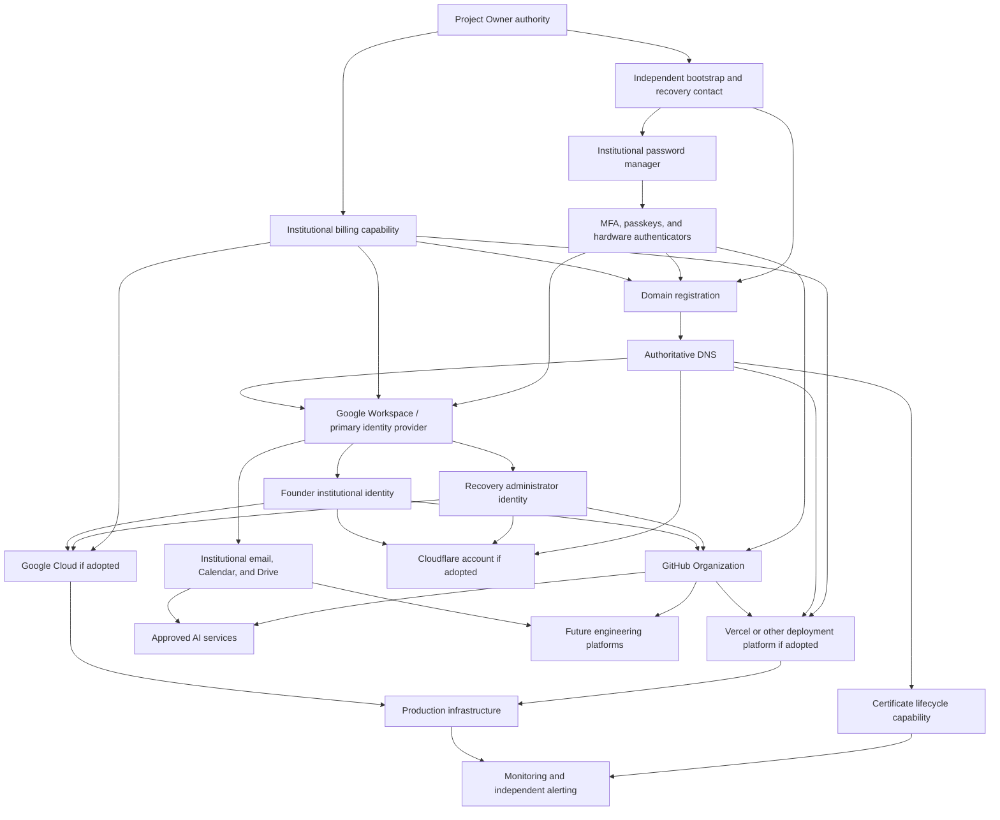

# ﷽

> الْحَمْدُ للّهِ رَبِّ الْعَالَمِينَ  
> יִשְׁתַּבַּח שִׁמְךָ לָעַד מַלְכֵּנוּ הָאֵל הַמֶּלֶךְ הַגָּדוֹל וְהַקָּדוֹשׁ בַּשָּׁמַיִם וּבָאָרֶץ  
> Thank God forever and ever.  
> וְאָהַבְתָּ לְרֵעֲךָ כָּמוֹךָ

# Mirleen Institutional Identity Blueprint

**Document class:** Institutional Architecture Blueprint  
**Authority level:** Project and Operational Architecture  
**Governing authority:** `governance/MIRLEEN_CONSTITUTION.md`  
**Related proposals:** MCA-001 and MCA-002; neither proposal is treated as constitutional authority unless ratified  
**Scope:** Target-state institutional identity and account architecture for Mirleen  
**Owner:** Project Owner  
**Architecture steward:** Institutional Identity Owner  
**Status:** Active — Authoritative Target-State Blueprint  
**Nature:** Architecture, not inventory  
**Recovery Point:** Repository commit `9f660763356d7e1cbaa20f2fb4f131e1c8eddc04`, immediately preceding this document  
**Review trigger:** Material identity-provider, domain, ownership, security, recovery, or institutional-service change

## 1. Purpose

This blueprint defines how Mirleen shall establish, control, recover, and evolve its institutional digital identity. It is the engineering design for the identities, trust relationships, institutional services, control boundaries, and recovery paths through which Mirleen owns and operates its digital presence.

It is intentionally not an inventory. It does not assert that any named account, subscription, domain, tenant, or service currently exists. Current operational state shall later be recorded in the appropriate evidentiary registers after their governing authority and schemas exist.

This blueprint is technology-aware because present services shape real dependencies and risks. It remains architecture-driven: vendors are assigned roles within a design, and no vendor is allowed to become the conceptual architecture itself.

## 2. Governing principles

The architecture derives from the current Mirleen Constitution:

1. **Human accountability:** tools and providers do not replace accountable human authority.
2. **Documentation as implementation:** ownership, access, dependencies, recovery, and decisions are part of the implemented identity system.
3. **Least privilege:** identities receive only the authority necessary for their role.
4. **Reversibility and recovery:** significant identity and service changes require an appropriate Recovery Point or compensating recovery strategy.
5. **Evidence:** claims of control, recovery, renewal, or operational readiness require evidence proportionate to risk.
6. **Traceability:** significant decisions and changes leave durable records.
7. **Simplicity:** services and dependencies must justify their lifecycle cost and risk.
8. **Proportionality:** controls scale with criticality, sensitivity, impact, and recoverability.

MCA-001 and MCA-002 provide relevant proposed direction for Single Source of Truth, Engineering Humility, Operational Assets, and Renewal Assurance. This blueprint is compatible with those proposals but does not treat them as ratified constitutional law.

## 3. Architectural objectives

Mirleen’s institutional identity architecture shall:

- preserve organizational control independently of any single employee, device, mailbox, phone number, vendor, or AI system;
- prevent circular recovery dependencies;
- separate daily work from privileged administration and emergency recovery;
- make ownership, authority, dependencies, and recovery paths understandable;
- use organization-controlled identities for institutional services;
- minimize shared credentials and persistent secrets;
- support secure onboarding, role change, offboarding, and transfer of stewardship;
- preserve continuity when a provider, identity, credential, payment method, or administrator becomes unavailable;
- ensure renewable services are visible early enough to renew or replace safely;
- support future growth without requiring an immediate enterprise-scale bureaucracy; and
- provide the architecture from which an Operational Asset Register can later be populated.

## 4. Trust model

Mirleen shall use a layered trust model. No single vendor account is “the root” of the organization. Root authority is a logical control plane implemented through deliberately separated identities, custody mechanisms, and recovery evidence.

```text
Project Owner authority
        │
        ├── Independent bootstrap and recovery identity
        ├── Institutional credential custody
        ├── Hardware-backed strong authentication
        └── Institutional billing authority
                    │
                    ▼
            Domain registration
                    │
                    ▼
           Authoritative DNS
                    │
                    ▼
     Primary institutional identity provider
          ┌─────────┼──────────┐
          ▼         ▼          ▼
    Human users   Admins   Recovery admins
          │         │          │
          └──────┬──┴──────┬───┘
                 ▼         ▼
          Engineering   Institutional
            services      operations
                 │
                 ▼
        Workload/service identities
```

The independent bootstrap and recovery identity must not depend exclusively on the Mirleen domain, its authoritative DNS, or the primary institutional identity provider. This breaks the failure cycle in which loss of the domain disables the email required to recover the domain.

## 5. Identity classes

### 5.1 Root identity

The **Root Identity** is the logical highest-control identity boundary for Mirleen’s institutional digital estate. It is not a normal mailbox and should not be a single credential reused across services.

The Root Identity consists of:

- the Project Owner’s legally and organizationally accountable authority;
- one or more dedicated root-control accounts at foundational providers;
- protected institutional credential custody;
- multiple hardware-backed authentication factors;
- offline recovery evidence;
- an independent recovery contact not exclusively dependent on Mirleen-operated services;
- traceable billing and registrant authority; and
- a documented transfer and succession path.

Root-control accounts shall not be used for ordinary email, browsing, development, deployments, or routine administration. They shall be used only for establishing lower-level administrators, recovering control, changing foundational ownership, and other actions whose impact justifies root authority.

### 5.2 Administrative identities

Administrative identities are dedicated, named identities used for privileged administration. They shall be separate from ordinary human identities where the provider permits practical separation.

Administrative identities shall:

- be attributable to a person or formally controlled emergency role;
- use phishing-resistant authentication where supported;
- avoid routine productivity use;
- receive the minimum administrative role required;
- be reviewed when responsibilities change;
- have independent recovery appropriate to their privilege; and
- leave auditable records where the service supports them.

Shared administrative credentials are prohibited as a normal operating model. Where a provider technically requires a shared root or owner credential, its custody shall be controlled through the institutional credential system with access evidence and recovery safeguards.

### 5.3 Service identities

Service identities represent software, automation, integrations, deployments, or workloads rather than people.

Service identities shall:

- have a single documented purpose;
- be owned by an accountable human role;
- use workload identity federation or short-lived credentials where available;
- avoid interactive login unless technically unavoidable;
- have narrowly scoped permissions;
- be rotated, revoked, or replaced without depending on the continued presence of an individual;
- be traceable to the repository, system, and environment they serve; and
- have a documented recovery or recreation method.

Personal access tokens and human accounts shall not become permanent service identities merely because they are convenient.

### 5.4 Human identities

Human identities represent individual people acting for Mirleen. Each person shall receive a uniquely attributable institutional identity for organizational work.

Human identities shall:

- reflect a defined relationship with Mirleen;
- be provisioned through an approved lifecycle;
- receive access through roles or groups where practical;
- use strong authentication;
- avoid using personal accounts for institutional ownership;
- separate ordinary work from privileged administration;
- be promptly changed or disabled when the relationship or role changes; and
- transfer institutional information and ownership before deactivation.

The Founder Identity is a human identity with organizational significance. It shall not be the sole owner of every institutional service, the only recovery path, or the only holder of material knowledge.

### 5.5 Recovery identities

Recovery identities exist solely to restore access or transfer authority when normal identity paths fail.

Recovery identities shall:

- be independent of the failure domain they are intended to recover;
- remain inactive except for verification and recovery use;
- use strong, separately held authentication factors;
- be monitored where possible;
- have protected recovery evidence;
- be periodically verified without exposing secrets;
- have clear activation and post-use reset procedures; and
- never become an undocumented daily administrative shortcut.

At least one recovery path for the domain registrar and primary identity provider must remain usable when the Mirleen domain, DNS, and primary institutional email are simultaneously unavailable.

## 6. Identity lifecycle

All identity classes shall follow a lifecycle appropriate to their risk:

1. **Request:** establish legitimate purpose and accountable owner.
2. **Approval:** authorize the identity and its maximum privilege.
3. **Provisioning:** create the identity using institutional ownership and protected authentication.
4. **Verification:** verify access, recovery, logging, and expected permissions.
5. **Operation:** use only for its declared purpose.
6. **Review:** periodically confirm continued need, ownership, access, and recovery.
7. **Change:** record material role, privilege, authentication, or dependency changes.
8. **Suspension:** promptly contain suspected compromise or obsolete access.
9. **Transfer:** preserve organizational ownership before a person or provider changes.
10. **Retirement:** revoke access, preserve required evidence, remove dependencies, and verify closure.

## 7. Ownership model

The following roles are architectural responsibilities, not necessarily separate people during Mirleen’s earliest stage:

- **Project Owner:** final organizational authority and approval owner.
- **Institutional Identity Owner:** accountable for the identity architecture and lifecycle.
- **Service Owner:** accountable for a service’s legitimate purpose, configuration, dependencies, and continuity.
- **Security Custodian:** accountable for authentication controls, credential custody, and security review.
- **Recovery Custodian:** independently able to assist in verified recovery without becoming a routine administrator.
- **Billing Owner:** accountable for payment authority, invoices, renewal funding, and billing continuity.
- **Data Owner:** accountable for information retained within a service.

One person may initially hold several roles, but role concentration shall be documented as a risk rather than mistaken for separation of duties. A second trusted recovery custodian should be established as soon as Mirleen can do so responsibly.

## 8. Priority model

### P0 — Mandatory foundation

Required before Mirleen relies upon institutional digital services or creates production dependencies.

### P1 — Mandatory before production operation

Required before public or business-critical production operation, although some services may be established after the P0 identity foundation.

### P2 — Recommended resilience and scale

Not universally required on the first day, but expected when the associated risk, team size, data sensitivity, or operational reliance appears.

### P3 — Optional future capability

Adopted only when justified by a real use case, accountable ownership, lifecycle cost, security review, and exit strategy.

“Mandatory” describes the capability, not necessarily the named vendor. For example, authoritative DNS is mandatory; Cloudflare is one eligible implementation.

## 9. Institutional service architecture

### 9.1 Independent bootstrap and recovery contact

**Priority:** P0 — Mandatory foundation  
**Purpose:** Provides a recovery and bootstrap communication path independent of Mirleen’s domain and primary identity provider.  
**Why it exists:** Domain registration and Workspace cannot safely recover through email hosted only on the domain they control.  
**Dependencies:** Project Owner authority; protected credential custody; strong authentication.  
**Required before:** Domain registration, primary institutional identity provider, and any root provider account that uses it for recovery.  
**Owner:** Project Owner; Recovery Custodian as secondary where appropriate.  
**Recovery considerations:** Must be recoverable without Mirleen DNS or Workspace; recovery evidence must be protected and periodically verified.  
**Renewal requirements:** Provider availability and recovery factors must be reviewed; any paid service requires renewal assurance.  
**Security considerations:** Dedicated use, no routine correspondence, strong MFA, minimal forwarding, no public disclosure.  
**Operational Asset under MCA-002:** Yes, if MCA-002 is ratified and the identity materially supports institutional recovery.

### 9.2 Institutional password manager and credential custody

**Priority:** P0 — Mandatory foundation  
**Purpose:** Provides controlled custody for institutional credentials, recovery codes, account identifiers, and protected administrative notes.  
**Why it exists:** Institutional secrets must not depend on browser storage, personal memory, informal messages, or a single device.  
**Dependencies:** Root authority; independent recovery contact; strong authentication; documented emergency custody.  
**Required before:** Domain registrar, DNS, Workspace, GitHub, cloud, deployment, billing, and other institutional accounts.  
**Owner:** Security Custodian.  
**Recovery considerations:** Protected emergency kit, multiple authorized factors, tested account recovery, export or migration capability, and a plan for provider failure.  
**Renewal requirements:** Subscription renewal, payment continuity, access review, emergency-kit review, and periodic export or recovery validation according to risk.  
**Security considerations:** Strong master authentication, phishing-resistant MFA, restricted vault access, separation of personal and institutional secrets, audit evidence, and no plaintext duplication.  
**Operational Asset under MCA-002:** Yes.

### 9.3 MFA, passkeys, and hardware authenticators

**Priority:** P0 — Mandatory security capability  
**Purpose:** Protects root, administrative, recovery, human, and high-value service identities against credential theft.  
**Why it exists:** Password-only control is inadequate for institutional authority.  
**Dependencies:** Credential custody and identity enrollment processes.  
**Required before:** Any foundational provider account is considered operationally ready.  
**Owner:** Security Custodian; authenticators assigned to named custodians.  
**Recovery considerations:** At least two independent authenticators for root authority, protected recovery codes, known replacement process, and avoidance of a single phone or SIM as the only factor.  
**Renewal requirements:** Hardware has no ordinary subscription renewal but requires lifecycle inspection, compatibility review, replacement planning, and revocation when lost.  
**Security considerations:** Prefer phishing-resistant factors; prohibit unattended shared devices; record assignment without storing private secrets in ordinary documentation.  
**Operational Asset under MCA-002:** Authenticators and authentication services become Operational Assets when materially required for access or recovery.

### 9.4 Institutional billing capability

**Priority:** P0 — Mandatory before paid services  
**Purpose:** Provides organization-controlled payment authority, billing contact, invoice retention, and renewal funding.  
**Why it exists:** A valid service can fail when a personal card expires, a bank rejects payment, or billing ownership is inaccessible.  
**Dependencies:** Project Owner authority; protected billing identity; credential custody; independent communication path.  
**Required before:** Reliance upon paid domain, Workspace, cloud, password-management, monitoring, deployment, or other subscriptions.  
**Owner:** Billing Owner.  
**Recovery considerations:** Secondary authorized payment method where justified, accessible invoices, documented update process, and an escalation path for failed payment.  
**Renewal requirements:** Payment-method validity, billing-contact access, budget authorization, invoice review, and proactive reminders for time-bound commitments.  
**Security considerations:** Least access, financial-data protection, fraud monitoring, separation of billing administration from unnecessary technical privilege.  
**Operational Asset under MCA-002:** Yes.

### 9.5 Domain registration

**Priority:** P0 — Mandatory foundation  
**Purpose:** Establishes Mirleen’s primary institutional namespace and public identity anchor.  
**Why it exists:** Email, identity federation, websites, certificates, DNS, and organizational verification depend upon stable domain control.  
**Dependencies:** Independent bootstrap recovery contact; credential custody; MFA; billing capability; accurate registrant authority.  
**Required before:** Google Workspace domain use, institutional email, domain-based human identities, verified provider organizations, public services, and production certificates.  
**Owner:** Project Owner with an Institutional Identity Owner as operational steward.  
**Recovery considerations:** Independent recovery contact, registrar-lock awareness, transfer authorization custody, documented registrant proof, and a recovery path independent of Mirleen email.  
**Renewal requirements:** Auto-renew where appropriate, multi-year registration where justified, valid payment method, multiple proactive reminders, renewal verification, and an expiration recovery plan.  
**Security considerations:** Hardware-backed MFA, registrar lock, least privilege, controlled nameserver changes, protected transfer codes, monitored account and registrant changes.  
**Operational Asset under MCA-002:** Yes; critical and renewable.

### 9.6 Authoritative DNS

**Priority:** P0 — Mandatory foundation  
**Purpose:** Publishes the authoritative records for Mirleen domains and directs identity, email, verification, and production traffic.  
**Why it exists:** Domain ownership without reliable DNS cannot support institutional services.  
**Dependencies:** Domain registration; administrative identity; credential custody; MFA.  
**Required before:** Workspace verification, email routing, certificates, public services, provider verification, and production routing.  
**Owner:** Infrastructure Service Owner.  
**Recovery considerations:** Exportable zone state, documented authoritative nameservers, protected registrar access for provider replacement, known propagation implications, and tested restoration or migration.  
**Renewal requirements:** Subscription and billing where applicable; periodic review of records, provider status, DNSSEC state, and stale dependencies.  
**Security considerations:** Restricted change authority, audit logging, DNSSEC where operationally supportable, change review for critical records, prevention of dangling records and takeover exposure.  
**Operational Asset under MCA-002:** Yes.

### 9.7 Cloudflare

**Priority:** P1 — Recommended implementation; P0 if selected as authoritative DNS  
**Purpose:** May provide authoritative DNS, DNS security, edge routing, traffic protection, and related network services.  
**Why it exists:** It can implement required DNS and edge-security capabilities but is not itself a constitutional or architectural requirement.  
**Dependencies:** Domain registration; institutional administrative identities; credential custody; MFA; billing if paid capabilities are used.  
**Required before:** Only capabilities assigned to Cloudflare, such as its DNS or edge services; not required before Workspace if another authoritative DNS provider is used.  
**Owner:** Infrastructure Service Owner.  
**Recovery considerations:** Preserve zone export and configuration knowledge; retain registrar access outside Cloudflare; avoid making Cloudflare the only recovery channel; document bypass or provider migration for critical traffic.  
**Renewal requirements:** Plan and payment review for paid services; verify continued DNS delegation and service state.  
**Security considerations:** Multiple named administrators, least privilege, API-token scoping, protected account recovery, audit logging, and controlled nameserver changes.  
**Operational Asset under MCA-002:** Yes when adopted.

### 9.8 Google Workspace

**Priority:** P0 — Mandatory primary institutional identity and collaboration capability, subject to final provider decision  
**Purpose:** Provides the primary institutional identity directory, email, groups, administrative control, and collaboration foundation.  
**Why it exists:** Institutional work requires organization-controlled human identities, communication, lifecycle administration, and shared knowledge services.  
**Dependencies:** Domain, authoritative DNS, credential custody, MFA, billing, and an independent recovery contact.  
**Required before:** Stable domain-based Founder Identity, ordinary human identities, institutional email, most provider invitations, Calendar, Drive, and identity federation.  
**Owner:** Institutional Identity Owner.  
**Recovery considerations:** At least two super-admin paths where feasible, one protected recovery administrator, offline recovery evidence, domain and DNS recovery independence, data export capability, and a provider exit plan.  
**Renewal requirements:** Subscription and billing assurance, license review, administrative-contact validation, and periodic recovery verification.  
**Security considerations:** Dedicated admin identities, phishing-resistant MFA, group-based access, external-sharing controls, audit logs, least privilege, session and application controls, and prompt offboarding.  
**Operational Asset under MCA-002:** Yes; critical and renewable.

### 9.9 Founder institutional identity

**Priority:** P0 — Mandatory human identity  
**Purpose:** Represents the Founder acting institutionally within Mirleen’s primary identity system.  
**Why it exists:** Institutional decisions and ownership must be attributable to an organization-controlled identity rather than a personal mailbox.  
**Dependencies:** Google Workspace or the selected primary identity provider; domain; DNS; MFA.  
**Required before:** Creation or transfer of most institutional organizations and services into Mirleen-controlled ownership.  
**Owner:** Founder, governed by the Project Owner role.  
**Recovery considerations:** Must not be the only super administrator, GitHub owner, billing authority, recovery identity, or knowledge holder. Recovery must not depend solely on the same mailbox.  
**Renewal requirements:** Identity-provider subscription and periodic role/access review.  
**Security considerations:** Separate daily and administrative access where practical; strong authentication; no shared use; careful OAuth authorization.  
**Operational Asset under MCA-002:** The identity and its institutional control relationships are Operational Assets when material to service ownership.

### 9.10 Recovery administrator identity

**Priority:** P0 — Mandatory recovery control  
**Purpose:** Provides an alternative privileged path when ordinary Founder or administrator access fails.  
**Why it exists:** A sole super administrator is a critical single point of failure.  
**Dependencies:** Primary identity provider; independent recovery evidence; credential custody; distinct authentication factors.  
**Required before:** The identity provider is considered resilient or business-critical services depend exclusively upon it.  
**Owner:** Recovery Custodian under Project Owner authority.  
**Recovery considerations:** Protected, minimally used, periodically verified, alerting enabled, activation documented, credentials reset after use.  
**Renewal requirements:** License and access continuity if required; scheduled verification of viability and custodian authority.  
**Security considerations:** No routine work, highest-assurance authentication, restricted recovery information, monitored use.  
**Operational Asset under MCA-002:** Yes.

### 9.11 Institutional email

**Priority:** P0 — Mandatory communication capability  
**Purpose:** Provides attributable organization-controlled communication and recovery contact for non-foundational services.  
**Why it exists:** Provider ownership, security notifications, billing notices, and engineering communication require durable institutional addresses.  
**Dependencies:** Domain, DNS, Workspace or selected mail provider, human identities, security configuration.  
**Required before:** Routine institutional enrollment in GitHub, cloud, deployment, monitoring, AI, and future platforms.  
**Owner:** Institutional Identity Owner; mailbox owners for their content.  
**Recovery considerations:** Administrative recovery through the identity provider; continuity plan for mail outage; critical external recovery must not depend only on this email.  
**Renewal requirements:** Provider subscription, domain renewal, mail-routing verification, license review.  
**Security considerations:** Anti-phishing controls, strong authentication, protected administrative roles, retention appropriate to obligations, safe forwarding rules, and monitored security alerts.  
**Operational Asset under MCA-002:** Yes as part of the institutional identity and communication service.

### 9.12 Calendar

**Priority:** P0 for institutional scheduling and renewal coordination; implemented as part of Workspace unless otherwise decided  
**Purpose:** Coordinates organizational commitments, reviews, renewals, operational events, and accountable reminders.  
**Why it exists:** Time-bound obligations must not depend upon unaided personal memory.  
**Dependencies:** Primary identity provider; institutional human identities; appropriate shared-calendar ownership.  
**Required before:** Calendar-based renewal assurance is relied upon; not a substitute for an asset register or verified renewal workflow.  
**Owner:** Institutional Operations Owner; event owners remain accountable for actions.  
**Recovery considerations:** Shared organizational ownership, delegated access, export capability, and avoidance of reminders stored only in a departing person’s private calendar.  
**Renewal requirements:** Inherits provider renewal; recurring reminders must be reviewed when ownership or asset state changes.  
**Security considerations:** Limit sensitive details in event descriptions; control external sharing; do not place credentials or recovery codes in calendar entries.  
**Operational Asset under MCA-002:** The calendar service is an Operational Asset when relied upon for continuity; individual reminders are evidence mechanisms, not independent assets by default.

### 9.13 Drive and shared institutional storage

**Priority:** P0 for institutional documents and shared operational knowledge  
**Purpose:** Stores organization-owned working documents, evidence, exports, and shared knowledge that do not belong solely in source control or protected secret custody.  
**Why it exists:** Institutional knowledge must outlive individual accounts and devices.  
**Dependencies:** Primary identity provider; groups; data ownership and sharing controls.  
**Required before:** Reliance on shared operational documents, provider evidence, or administrative exports outside repositories.  
**Owner:** Data Owner with the Institutional Identity Owner administering access.  
**Recovery considerations:** Shared drives or equivalent organization ownership, export strategy, access continuity, retention, and restoration appropriate to data importance.  
**Renewal requirements:** Provider and storage subscription assurance; capacity and license review.  
**Security considerations:** Classification-aware sharing, least privilege, restricted external access, no plaintext secrets, auditability, and clear authoritative-source boundaries.  
**Operational Asset under MCA-002:** Yes when it carries institutional operational knowledge or evidence.

### 9.14 GitHub Organization

**Priority:** P0 — Mandatory engineering system  
**Purpose:** Provides institutional ownership of source repositories, change history, engineering decisions, automation, and access control.  
**Why it exists:** Mirleen engineering artifacts must not be owned solely by a personal account.  
**Dependencies:** Founder institutional identity; at least one additional recoverable owner path; MFA; institutional billing if paid; domain verification where used.  
**Required before:** Institutional source repositories, production automation, organizational policies, and long-term engineering collaboration.  
**Owner:** Engineering Platform Owner.  
**Recovery considerations:** At least two organization owners where feasible, protected owner accounts, repository mirrors or exports proportionate to criticality, documented support and ownership evidence, and recovery from compromised automation credentials.  
**Renewal requirements:** Plan and billing review, owner access review, application and token review, domain-verification continuity.  
**Security considerations:** Mandatory strong authentication, least-privilege teams, protected branches, scoped applications, secret scanning, audit logs, and separation of human and automation identities.  
**Operational Asset under MCA-002:** Yes; critical and renewable when paid services are used.

### 9.15 Google Cloud

**Priority:** P1 when selected for workloads; otherwise P2 candidate platform  
**Purpose:** Provides cloud projects, infrastructure, workloads, data services, identity integration, and billing boundaries.  
**Why it exists:** It implements cloud capabilities when justified by a system architecture; it is not mandatory merely because Workspace is used.  
**Dependencies:** Institutional identities; groups; billing; credential custody; engineering ownership; security and recovery design.  
**Required before:** Any Mirleen workload assigned to Google Cloud.  
**Owner:** Cloud Platform Owner.  
**Recovery considerations:** Multiple controlled administrators, organization and project hierarchy evidence, infrastructure-as-code where practical, data backup and restoration, billing recovery, and provider-exit analysis for critical workloads.  
**Renewal requirements:** Billing and budget continuity; review of commitments, support plans, quotas, certificates, and expiring credentials.  
**Security considerations:** Federated human access, short-lived workload identity, least privilege, separation of production, logging, key management, network boundaries, and no personal project ownership.  
**Operational Asset under MCA-002:** Yes when adopted.

### 9.16 Vercel

**Priority:** P1 when selected for production web delivery; otherwise P2  
**Purpose:** Provides managed build, deployment, hosting, preview, and domain-binding capabilities for applicable web systems.  
**Why it exists:** It may reduce operational complexity for suitable workloads but is not the architectural definition of production infrastructure.  
**Dependencies:** GitHub Organization, institutional identities, DNS, domain, billing for paid use, scoped deployment identities, monitoring.  
**Required before:** Production deployment only for systems architecturally assigned to Vercel.  
**Owner:** Web Platform or Application Service Owner.  
**Recovery considerations:** Source and build configuration remain recoverable outside Vercel; document environment configuration custody, domain cutover, deployment rollback, data-service dependencies, and migration path.  
**Renewal requirements:** Subscription, billing, domain attachment, integration-token, and seat review.  
**Security considerations:** SSO or institutional accounts where available, least privilege, protected environment variables, scoped GitHub integration, production access controls, and audit evidence.  
**Operational Asset under MCA-002:** Yes when adopted.

### 9.17 Certificate lifecycle capability

**Priority:** P1 — Mandatory before protected production endpoints  
**Purpose:** Issues, deploys, renews, validates, and replaces certificates used for trusted communication or identity.  
**Why it exists:** An expired or inaccessible certificate can interrupt production even when every other system is healthy.  
**Dependencies:** Domain, DNS or endpoint control, infrastructure ownership, monitoring, and renewal automation where appropriate.  
**Required before:** TLS-protected production endpoints or other certificate-dependent services.  
**Owner:** Infrastructure or Security Service Owner.  
**Recovery considerations:** Reissuance capability, key and account custody appropriate to the certificate model, alternate validation path, and emergency replacement procedure.  
**Renewal requirements:** Automated renewal where safe, expiry monitoring independent of the renewal mechanism, proactive alerts, and post-renewal verification.  
**Security considerations:** Protect private keys, minimize export, use scoped issuance authority, monitor unexpected issuance, revoke compromised certificates.  
**Operational Asset under MCA-002:** Certificates and issuing-service relationships are Operational Assets when material.

### 9.18 Monitoring and alerting

**Priority:** P1 — Mandatory before production operation  
**Purpose:** Detects availability, security, certificate, DNS, deployment, billing, and renewal failures and routes actionable alerts.  
**Why it exists:** A control that fails silently is not a reliable operational capability.  
**Dependencies:** Monitored systems; institutional responders; at least one notification path independent of the system being monitored.  
**Required before:** Public or business-critical production reliance.  
**Owner:** Reliability Owner.  
**Recovery considerations:** Independent status access, alternate notification route, configuration export, responder succession, and a plan for monitoring-provider failure.  
**Renewal requirements:** Subscription, contact validation, integration-token review, alert-route tests, and capacity review.  
**Security considerations:** Least-privilege telemetry access, protected tokens, sensitive-data minimization, alert-spoofing awareness, and controlled incident information.  
**Operational Asset under MCA-002:** Yes when adopted.

### 9.19 AI services

**Priority:** P2 — Recommended only for approved use cases; P3 for experimental services  
**Purpose:** Supports engineering, analysis, automation, research, or organizational work where beneficial and governed.  
**Why it exists:** AI can extend capability but must not become an unaccountable authority, undocumented knowledge store, or hidden production dependency.  
**Dependencies:** Institutional identities, billing, data-use decision, security review, accountable owner, and repository or process integration where applicable.  
**Required before:** Only the approved AI-assisted capability that depends upon it. No AI vendor is foundational to Mirleen identity.  
**Owner:** AI Service Owner with accountable human decision authority.  
**Recovery considerations:** Export important prompts, decisions, configurations, and knowledge into authoritative Mirleen systems; provide a non-AI or alternate-provider path for critical workflows; revoke integrations on compromise.  
**Renewal requirements:** Subscription, seat, billing, data-processing terms, model availability, integration credential, and continued-need review.  
**Security considerations:** Data classification, confidentiality, human review, uncertainty disclosure, minimal privileges, controlled connectors, and prohibition on placing secrets into unapproved AI contexts.  
**Operational Asset under MCA-002:** Yes when institutionally adopted and materially relied upon; experimental personal use must not become institutional ownership.

### 9.20 Future engineering platforms

**Priority:** P3 — Optional future capability  
**Purpose:** Adds new engineering, collaboration, deployment, security, data, or operational capability when a justified need exists.  
**Why it exists:** MES must accommodate future platforms without allowing uncontrolled service proliferation.  
**Dependencies:** Approved decision, institutional identity integration, accountable owner, billing and renewal design, security review, recovery and exit plan, and traceability.  
**Required before:** Only the capability whose approved architecture depends upon the platform.  
**Owner:** Designated Service Owner.  
**Recovery considerations:** Data and configuration portability, alternative operating method, revocation, provider failure, and exit strategy.  
**Renewal requirements:** Explicit renewal owner, lead time, reminder and escalation design, funding, and successful-renewal verification.  
**Security considerations:** Least privilege, institutional ownership, vendor risk, data handling, integration scope, and avoidance of personal-account ownership.  
**Operational Asset under MCA-002:** Yes when adopted and material under the proposed definition.

## 10. Mandatory, recommended, and optional infrastructure

### Mandatory foundation

- Independent bootstrap and recovery contact
- Institutional password manager and credential custody
- MFA/passkeys with multiple hardware-backed recovery factors for root authority
- Institutional billing capability before paid services
- Domain registration
- Authoritative DNS
- Primary institutional identity provider and email
- Founder institutional identity
- Recovery administrator identity
- Calendar and organization-owned shared document storage
- GitHub Organization

### Mandatory before relevant production use

- Monitoring and independent alert routing
- Certificate lifecycle capability
- A cloud or hosting platform selected by the system architecture
- Production recovery and rollback capability
- Service identities for production automation

### Recommended resilience and scale

- Cloudflare when justified as DNS or edge provider
- Google Cloud when justified for workloads
- Vercel when justified for managed web delivery
- Secondary recovery custodian
- Independent exports or backups for critical provider state
- Centralized audit and security monitoring as the estate grows
- Organization-wide identity federation and automated lifecycle management when scale warrants it

### Optional future capability

- Additional AI services
- Additional cloud or deployment platforms
- Dedicated asset-management automation
- Advanced identity governance platforms
- Additional observability, security, data, and collaboration systems

A vendor moves from optional to mandatory only when an approved architecture makes a material capability depend upon it. That dependency must be documented before production reliance.

## 11. Dependency graph and creation order

The correct creation order differs from a simple `Domain → Workspace → Founder Identity` chain because the domain itself needs an independent recovery identity, protected credentials, strong authentication, and billing authority.



### Creation sequence

1. Confirm Project Owner authority and designate identity, security, recovery, and billing responsibilities.
2. Establish an independent bootstrap and recovery contact.
3. Establish institutional credential custody.
4. Enroll multiple strong authentication factors and preserve protected recovery evidence.
5. Establish organization-controlled billing authority before paid dependencies.
6. Register the domain using independent recovery and institutional ownership.
7. Establish authoritative DNS.
8. Establish Google Workspace or the selected primary institutional identity provider.
9. Establish Founder, recovery administrator, and ordinary institutional identities.
10. Verify email, Calendar, Drive, groups, administrative recovery, and ownership boundaries.
11. Create or transfer the GitHub Organization into institutional control with more than one viable owner path.
12. Establish Cloudflare, Google Cloud, Vercel, or other platforms only where their architectural roles are approved.
13. Establish certificate lifecycle management and service identities before protected production use.
14. Establish monitoring with a notification path independent of the production failure domain.
15. Enable production only after identity recovery, deployment rollback, monitoring, billing continuity, and critical renewal controls are verified.
16. Add AI and future platforms only through accountable institutional adoption.

## 12. Single points of failure and mitigations

| Single point of failure | Consequence | Required mitigation |
|---|---|---|
| One Founder personal email bootstraps every service | Loss or compromise can remove institutional control | Use a dedicated independent recovery contact; transition routine ownership to institutional identities; preserve evidence of legal and organizational authority |
| Mirleen email is the registrar’s only recovery path | Domain or Workspace failure blocks domain recovery | Maintain an independent external recovery identity and verified registrar recovery evidence |
| One domain registrar account | Domain loss, hijack, or inaccessible renewal | Strong MFA, protected recovery, registrar lock, accurate registrant data, secondary custodian, proactive renewal assurance |
| One domain | Identity and public services share a namespace failure domain | Protect the primary domain rigorously; consider a separately controlled recovery domain only when complexity is justified; never use an ungoverned domain as a hidden dependency |
| One authoritative DNS provider | DNS outage or account lock affects all domain services | Preserve registrar independence, export zone state, document provider migration, control DNSSEC recovery, consider secondary DNS when risk warrants it |
| One Workspace super administrator | Lockout or compromise can control all identities | Maintain at least two viable privileged paths, including a protected recovery administrator; use distinct authentication factors and periodic verification |
| Founder daily account is also every service’s root admin | Phishing or daily-use compromise becomes organization-wide compromise | Separate daily and administrative identities; minimize root usage; assign scoped administrators |
| One hardware key or one phone | Loss prevents access; SIM attack compromises recovery | Maintain multiple hardware-backed factors stored separately; do not rely on SMS as the sole high-value factor |
| One password-manager account or device | Loss blocks access to institutional credentials | Emergency kit, multiple authorized factors, tested recovery, protected export or migration capability, separate recovery custody |
| Recovery codes stored only inside the account they recover | Account loss makes recovery evidence inaccessible | Store protected offline or independently accessible recovery evidence with controlled custody |
| One billing card or billing owner | Failed payment suspends multiple critical services | Secondary authorized payment method where justified, proactive expiry review, accessible invoices, billing escalation and renewal verification |
| One GitHub Organization owner | Loss or compromise blocks repository administration | At least two viable owner paths, strong MFA, protected recovery, organization-owned repositories, audit evidence |
| Personal tokens operate production automation | Departure or token revocation breaks production | Use dedicated service identities, scoped applications, workload federation, documented token rotation and recreation |
| One cloud organization administrator | Infrastructure lockout or destructive control | Multiple controlled admins, least privilege, break-glass path, infrastructure evidence, audit logs, recovery exercises |
| One deployment provider account | Deployment and domain control may become inaccessible | Institutional team ownership, secondary admin, recoverable configuration, source-controlled build design, alternate deployment path for critical systems |
| Deployment platform also owns the only DNS path | Platform failure prevents traffic migration | Keep domain and registrar control independent; preserve ability to change DNS outside the deployment provider |
| Monitoring alerts use only the failing system’s email | Outage prevents notification | Maintain at least one independent alert destination and periodically test delivery |
| Certificate renewal and monitoring share one automation | Automation failure causes silent expiry | Independent expiry monitoring, proactive alerts, emergency reissuance procedure, post-renewal verification |
| One recovery custodian | Absence or incapacity prevents emergency action | Establish a second authorized custodian or documented succession mechanism proportional to risk |
| One person holds all institutional knowledge | Departure causes unrecoverable operational ambiguity | Document architecture, ownership, procedures, decisions, and recovery evidence in organization-controlled systems |
| One identity provider controls all admin recovery | Provider lockout affects every downstream service | Retain independent bootstrap identity, protected provider-specific recovery, and non-federated break-glass paths where justified |
| One AI provider retains unique engineering knowledge | Provider change destroys organizational memory | Preserve decisions, prompts of durable value, configurations, and conclusions in authoritative Mirleen systems; maintain human-readable operating knowledge |
| One billing or identity provider is concentrated across many services | Common-mode provider failure affects the whole organization | Identify concentration explicitly, preserve independent recovery paths, maintain exports and exit plans, and avoid unnecessary coupling |

## 13. Security architecture

### 13.1 Authentication

- Prefer passkeys or hardware-backed authentication for root and administrative identities.
- Maintain multiple factors across separate physical custody locations for root recovery.
- Do not rely upon SMS or a single mobile device as the only factor for critical authority.
- Protect recovery codes as secrets and verify that they remain accessible independently of the primary identity.

### 13.2 Authorization

- Assign privilege through roles and groups where possible.
- Separate owner, administrator, billing, security, and ordinary-user capabilities.
- Remove standing privilege when temporary elevation can satisfy the need.
- Review high-impact privileges after personnel or architecture changes.

### 13.3 Credential and secret custody

- Store institutional credentials only in approved protected custody.
- Do not place passwords, private keys, recovery codes, payment credentials, or unrestricted tokens in source repositories, ordinary documentation, calendars, or asset registers.
- Record where a secret is held and who may access it without reproducing the secret.
- Prefer short-lived or federated service credentials over static secrets.

### 13.4 Provider federation

Federation reduces password sprawl but can create a shared failure domain. Mirleen should federate ordinary access where the operational benefit exceeds the recovery risk, while preserving provider-specific break-glass access for services whose recovery would otherwise depend entirely on the primary identity provider.

### 13.5 Logging and evidence

High-impact identity events should produce evidence where supported, including:

- owner and administrator changes;
- authentication-factor changes;
- recovery actions;
- domain and DNS changes;
- billing and renewal changes;
- service-identity creation and credential changes;
- external application authorization; and
- account suspension or deletion.

Evidence must be retained proportionately and protected from unauthorized alteration or disclosure.

## 14. Recovery architecture

### 14.1 Recovery order

When institutional identity control is impaired, recovery should proceed from the lowest external dependency upward:

1. establish Project Owner and recovery authority;
2. access independent recovery contact and protected credential custody;
3. restore registrar control;
4. restore authoritative DNS;
5. restore primary identity-provider administration;
6. restore administrative and human identities;
7. restore GitHub and cloud/deployment control;
8. restore workload identities and production integrations;
9. validate monitoring, certificates, billing, and renewal mechanisms; and
10. record the incident, recovery evidence, and required improvements.

### 14.2 Recovery evidence

A claimed recovery capability should identify:

- recovery owner and alternate;
- triggering conditions;
- dependencies;
- required credentials or custody locations;
- provider support or legal-ownership evidence;
- expected impact and time;
- verification criteria;
- post-recovery credential reset or hardening; and
- last validation result.

An undocumented or unverified recovery assumption must be labeled as an assumption, not represented as established capability.

### 14.3 Transfer and succession

Institutional identity must survive a change in people. Root authority, provider ownership, billing authority, recovery custody, and institutional knowledge shall have a documented transfer path. Transfers are significant engineering changes and require verification that old access has been removed and new recovery works.

## 15. Renewal architecture

This blueprint adopts the following design for renewable institutional services without treating MCA-002 as ratified constitutional law:

1. Every renewable service has a responsible Service Owner and Billing Owner.
2. Renewal conditions, date or boundary, lead time, cost authority, payment method, and verification method are documented in the future authoritative register.
3. Reminder mechanisms begin early enough to permit renewal, correction of payment or ownership problems, or provider migration.
4. Critical renewals have escalation and, where justified, more than one reminder channel.
5. A reminder is not proof of renewal.
6. Renewal completion is verified at the provider and recorded.
7. Auto-renew reduces routine risk but does not replace billing validation, reminder, or post-renewal verification.
8. Failure to renew a critical service has a continuity or recovery response.

Calendar may implement reminders, but the future Operational Asset Register should remain the authoritative evidence of asset state if MCA-002 is ratified and implemented.

## 16. Operational Asset Register readiness

This document defines future register requirements but does not populate an inventory.

For each adopted institutional service, the eventual register should be capable of referencing:

- asset identifier and class;
- authoritative provider and tenant or organization reference;
- legitimate purpose;
- criticality;
- accountable owner and steward;
- administrative, billing, security, and recovery roles;
- authoritative identity used for ownership;
- upstream and downstream dependencies;
- lifecycle state;
- contract, subscription, renewal, or expiration boundary;
- renewal lead time and assurance state;
- reminder and escalation mechanisms;
- verified renewal evidence;
- recovery and continuity reference;
- secret-custody system reference without secret values;
- related decisions and repository dependencies;
- last review and next review; and
- retirement or transfer evidence.

These fields are architectural input to a future standard and schema. They do not themselves establish a ratified Operational Asset Register.

## 17. Prohibited dependency patterns

Mirleen should not intentionally create these patterns:

- registrar recovery depends only on email hosted by the registered domain;
- all root factors are stored on one device or in one location;
- every service is owned by a personal account;
- the Founder’s daily account is the sole super administrator everywhere;
- production automation runs indefinitely through personal tokens;
- the deployment provider is the only path to change DNS;
- recovery codes exist only inside the primary password vault without independent recovery;
- renewal reminders exist only in a private calendar;
- monitoring alerts are delivered only through the system being monitored;
- a payment method is both unmonitored and irreplaceable;
- an AI service is the sole store of institutional decisions or knowledge;
- a provider is adopted without an owner, recovery plan, renewal plan, or exit consideration; or
- a future asset register contains plaintext secrets.

## 18. Adoption gates

### Foundation gate

Mirleen may establish institutional services after verifying independent recovery contact, protected credential custody, strong authentication, billing authority, and accountable ownership.

### Identity gate

Domain-based institutional ownership may be relied upon after verifying domain control, authoritative DNS, primary identity-provider administration, Founder Identity, recovery administrator access, and independent recovery.

### Engineering gate

Institutional engineering repositories and automation may be relied upon after verifying GitHub organization ownership, multiple viable owner paths, service-identity design, and recovery evidence.

### Production gate

Production may be relied upon after verifying deployment ownership, DNS control, certificate lifecycle, monitoring, independent alerting, billing continuity, rollback or recovery, and repository-specific documentation.

### Expansion gate

A future platform may be adopted only after establishing purpose, owner, identity model, dependencies, security, billing, renewal, recovery, data handling, and exit strategy.

## 19. Critical design review

This section records the critical review performed before publication.

### 19.1 Review scope

Reviewed completely:

- this blueprint;
- the current Mirleen Constitution;
- MCA-001 as an unratified proposal; and
- MCA-002 as an unratified proposal.

Not reviewed:

- any live Mirleen account inventory;
- provider tenant configurations;
- domain-registration state;
- billing instruments;
- existing credentials or recovery factors;
- contracts, pricing, legal availability, or jurisdiction-specific requirements; and
- production infrastructure, because no such evidence was provided for this review.

### 19.2 Observed facts

- The current Constitution requires human accountability, documentation, least privilege, evidence, ownership, traceability, recovery, and proportionality.
- MCA-001 and MCA-002 are marked proposed and have no constitutional effect before explicit ratification.
- The Project Owner has selected MES as the official system name and requested Google Workspace, Google Cloud, GitHub, Cloudflare, Vercel, and other service classes to be considered.
- No evidence supplied for this review establishes which services currently exist or their configuration.

### 19.3 Interpretations and assumptions

- **Interpretation:** An “authoritative blueprint” is a target-state design and does not prove current implementation.
- **Assumption:** Google Workspace is the intended primary institutional identity and collaboration provider. A different provider would require an architectural decision and compatibility review, not a constitutional amendment.
- **Assumption:** Mirleen is initially founder-led and may not immediately have multiple employees capable of full separation of duties.
- **Assumption:** Cloudflare, Google Cloud, and Vercel are candidate implementations, not universal requirements.
- **Assumption:** Mirleen will later establish policies, standards, procedures, and registers that operationalize this architecture.

### 19.4 Strengths

- The design breaks the domain–email recovery cycle with an independent bootstrap identity.
- It separates root, administrative, service, human, and recovery identities.
- It treats vendor services as architectural roles rather than making vendors the architecture.
- It connects identity, billing, renewal, monitoring, recovery, and knowledge preservation.
- It defines production gates and explicit prohibited dependency patterns.
- It prepares for an Operational Asset Register without creating an unsupported inventory.

### 19.5 Risks and challenges

1. **Founder concentration remains likely at the beginning.** Role separation on paper is not operational separation when one person holds every role.
2. **Google concentration is substantial.** Workspace and Google Cloud can create a common identity, billing, and provider failure domain.
3. **An external recovery identity introduces another provider dependency.** Independence reduces circularity but does not remove the need to govern and recover that identity.
4. **A password manager can become a high-value concentration point.** Strong recovery and independent emergency evidence are essential.
5. **Multiple providers increase complexity.** Registrar, DNS, identity, source control, cloud, and deployment separation improves resilience but creates more renewal and access paths to manage.
6. **Two administrators can increase attack surface.** Secondary control must be protected and monitored, not merely added.
7. **Backups and exports may not reproduce provider behavior.** Recovery claims require practical validation rather than possession of files alone.
8. **Cloudflare and Vercel are not automatically necessary.** Adopting them without a justified capability would violate simplicity.
9. **Calendar reminders may create false confidence.** They must be linked to accountable renewal verification.
10. **Actual feasibility is unverified.** Provider features, account types, regional availability, and costs require validation during implementation.

### 19.6 Recommendations arising from the review

- Implement only the P0 bootstrap chain first; do not create every proposed service immediately.
- Establish a second recovery custodian as soon as a trustworthy and secure arrangement is possible.
- Keep registrar recovery independent of Mirleen email and, where practical, keep registrar control independent of the authoritative DNS provider.
- Do not adopt Google Cloud merely because Google Workspace is used.
- Do not adopt Cloudflare or Vercel until an architecture assigns them a required capability.
- Test recovery paths and alert delivery before declaring the identity foundation or production system ready.
- Validate provider capabilities, pricing, contractual terms, export paths, and regional constraints before implementation decisions.
- Review provider concentration explicitly when more than one critical capability depends upon the same provider.

### 19.7 Review outcome

**Outcome:** Accepted as a target-state institutional identity architecture, subject to implementation validation and future subordinate governance.  
**Confidence:** High for the architectural principles and dependency model; moderate for vendor-specific feasibility because no live tenant or provider configuration was reviewed.  
**Primary limitation:** This blueprint does not establish current operational state and must not be used as an asset inventory.  
**Required follow-up:** Validate the P0 design against actual provider capabilities before creating or transferring institutional accounts.

## 20. Closing statement

Mirleen’s institutional identity shall be designed as enduring organizational infrastructure rather than a collection of convenient accounts. Ownership, authentication, billing, renewal, recovery, and knowledge shall remain traceable and transferable so that the organization can continue safely when people, devices, providers, and technologies change.

الحمد لله رب العالمين
